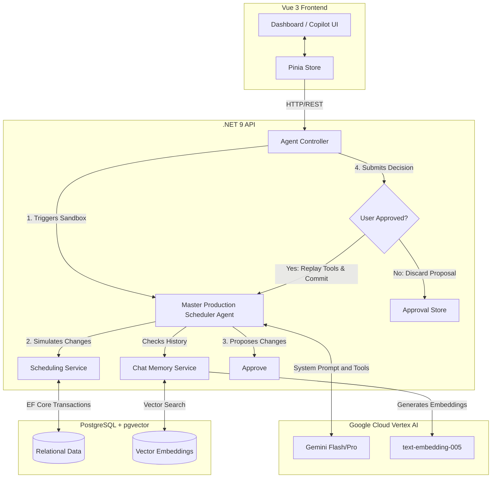

# AI Scheduler Architecture

This document outlines the architecture, components, and key technical decisions for the AI Manufacturing Scheduler application.

## High-Level Architecture
The application follows a standard three-tier architecture augmented with an AI Agent layer and a Vector Database for long-term memory.

1. **Frontend**: Vue 3 (Composition API) + Tailwind CSS + Pinia
2. **Backend**: .NET 9 Web API + Entity Framework Core
3. **Database**: PostgreSQL 16 + pgvector
4. **AI Layer**: Google Vertex AI (Gemini Flash/Pro models, text-embedding-005)

---

## 1. AI Agent Layer (The "Brain")
The core differentiator of this application is the autonomous Master Production Scheduler agent located in `MasterProductionSchedulerAgent.cs`.

### Sandbox Mode (Human-in-the-Loop)
To prevent catastrophic automated changes to manufacturing schedules, the agent operates in a "Sandbox Mode":
1. **Transaction Wrapping**: When the agent is triggered, the backend opens an Entity Framework Database Transaction.
2. **Analysis & Tool Execution**: The Gemini model analyzes the request, queries the database using read-only tools, and optionally executes mutation tools (e.g., `update_work_order_priority`, `update_purchase_order_status`).
3. **Rollback**: After the agent finishes its loop, the transaction is **rolled back**. None of the changes are committed.
4. **Proposal**: The simulated changes (what *would* have happened) are returned to the frontend as a "Proposal".
5. **Approval**: The user clicks "Approve" in the UI, which calls a backend endpoint that replays the exact tool calls against the live database, this time committing the transaction.

### Vector Chat Memory
The agent remembers past context using RAG (Retrieval-Augmented Generation) on chat history.
- **Embeddings**: Uses Vertex AI `text-embedding-005` to generate 768-dimensional vectors for user prompts and agent responses.
- **Storage**: Vectors are stored in the PostgreSQL database using the `pgvector` extension.
- **Retrieval**: Before calling Gemini, the `ChatMemoryService` performs a raw ADO.NET vector cosine similarity search (`<=>`) utilizing an HNSW index to find the Top-10 most relevant historical conversation turns. These are injected into the agent's system prompt.
- **Session Management**: A persistent UUID is generated on the frontend via `localStorage` and sent with every request to isolate user sessions.

---

## 2. Backend (.NET 9 Web API)
The backend acts as the orchestrator between the database, the Vue frontend, and the Vertex AI endpoints.

### Key Components
- **`AppDbContext`**: EF Core context managing all relational data and the `ChatConversations` pgvector table. Mapped using the `Pgvector.EntityFrameworkCore` package (`.HasColumnType("vector(768)")`).
- **`SchedulingService`**: Encapsulates core business logic (e.g., checking material availability, updating WOs) used by both normal API endpoints and the Agent's tools.
- **`AgentController`**: Exposes endpoints to trigger the agent (`/api/agent/run`), approve/reject proposals, and fetch/clear chat history.
- **`ApprovalStore`**: An in-memory cache (Singleton) that holds the exact sequence of tool calls for a pending proposal until the user approves or rejects it.

---

## 3. Frontend (Vue 3)
The frontend provides a real-time dashboard and a floating "AI Copilot" interface.

### Key Components
- **`ChatCopilot.vue`**: The floating chat interface. It manages the persistent user session, parses tool execution badges, and displays the "Approve/Reject" UI card when the agent returns a proposal in Sandbox Mode.
- **Pinia Store (`schedule.js`)**: Manages the global state. It polls the backend API (e.g., every 5 seconds) to keep the UI in sync with live database changes.
- **Dashboards**: Components like `WorkOrderPane.vue` and `PurchaseOrderPane.vue` reactively display data filtered and sorted based on priority and status.

---

## 4. Database (PostgreSQL + pgvector)
The database serves as the source of truth for both relational scheduling data and vector embeddings.

### Key Details
- **Docker Compose**: Uses the `pgvector/pgvector:pg16` image instead of standard Postgres.
- **Initialization**: `database/init.sql` automatically runs on container creation to construct tables, insert massive amounts of realistic seed data (WOs, POs, Inventory), and enable the `vector` extension.
- **JSONB**: EF Core maps complex types (like `RequiredMaterials` or the agent's `ToolCalls`) to `JSONB` columns in Postgres for flexible storage without over-normalizing the schema.
- **Indexing**: 
  - Standard indexes on unique constraints (e.g., `WorkOrderNumber`).
  - HNSW (Hierarchical Navigable Small World) index on the `Embedding` column for highly performant Approximate Nearest Neighbor (ANN) vector searches.
